# Interview Lab: AI-Powered Interview Preparation (MERN + Groq)

[](https://github.com/Piro-Programmer/AI_POWERED_INTERVIEW_PLATFORM/actions/workflows/ci-cd.yml)

**Live demo:** https://ai-powered-interview-platform-hywork.vercel.app/

[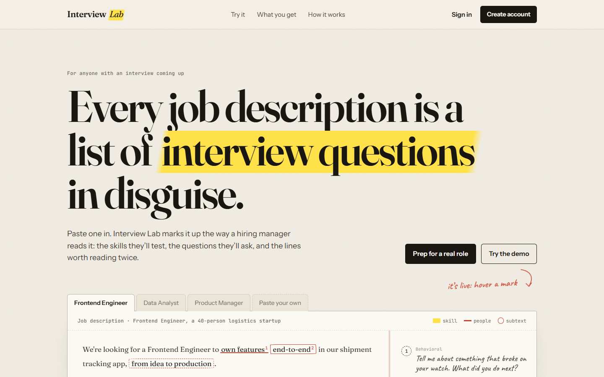](https://ai-powered-interview-platform-hywork.vercel.app/)

## Overview

Interview Lab is a full-stack web application built with the MERN stack and the Groq API. It helps candidates prepare for interviews in a focused, role-specific way.

Paste a job description, optionally upload your resume, and get a structured report: a match score, the questions you're likely to be asked (with the intent behind each and how to answer), your skill gaps, and a five-day preparation plan.

## Problem Statement

- Interview preparation is often too generic.
- Candidates may not know which questions match a specific job description.
- There is no simple structured workflow for practicing against real roles.

## Solution

The platform takes:

- Resume PDF text, if uploaded
- User self description
- Job description

Then the AI model (Groq) generates:

- Match score
- Technical interview questions
- Behavioral interview questions
- Suggested answers and the intent behind each question
- Skill gaps with severity
- Five-day preparation plan

Every response is validated against a strict schema before it reaches the user, and reports are saved in MongoDB for the logged-in user.

## Features

**Public landing page**
- Live, in-browser job description markup demo, with no account needed: skills are highlighted, people skills underlined and recruiter phrases circled, each with a margin note
- Paste your own job description, or select any phrase to mark it yourself

**Report**
- Match score that counts up inside a hand-drawn ring that closes only as far as the score
- Skill gaps highlighted inside your own job description, each linked to the plan day that covers it
- Questions fold away until opened, so you can answer out loud first
- Five-day plan as a checklist with progress, saved to your account so it follows you across devices
- While the report generates, your job description is shown being read, with an elapsed timer

**Practice mode**
- Answer each question by typing or speaking (browser speech-to-text in Chrome/Edge), with a two-minute interview clock
- AI feedback on every answer: a 0-10 score, four criteria (structure, specificity, relevance, clarity), what worked, what to fix, and a stronger version of your answer
- Behavioral answers are judged with STAR in mind; attempts to game the grader score 0-1
- Question chips show your best score; re-drill mode brings back only the weak ones
- Every attempt is saved, so you can see last and best scores per question

**Report history**
- Every saved report in one ledger: match score, date, top gaps and plan progress
- Search, sort by date or score, and filter by plan progress
- Open any report again, or practise the same role with the job description pre-filled

**Platform**
- Registration, login, logout and protected routes
- JWT authentication in an HTTP-only cookie
- Optional PDF resume upload with text extraction
- AI report generation with Groq (Gemini supported as a fallback)
- MongoDB persistence for interview reports
- React + Vite frontend, Express REST API backend
- Deployed with the frontend on Vercel and the backend on Render

**Limits and security**
- Daily AI allowances per user, shown in the UI: 10 reports and 30 answer reviews a day by default
- The allowance is reserved atomically in MongoDB, so parallel requests can't overshoot it, and a failed AI call gives it back
- One report generation at a time per user, plus a short burst limit
- Failed sign-ins are rate limited per account and per network; sign-ups per network
- Input caps (job description, profile, resume text, request size) and PDF-only uploads up to 3 MB
- Security headers via Helmet, and every error returned as JSON the UI can show

## Screenshots

Public pages are from the [live site](https://ai-powered-interview-platform-hywork.vercel.app/). Signed-in pages use a demo account with sample data.

### Landing page

The hero is a live demo: a real job description, marked up as you watch. Skills are highlighted, people skills underlined and recruiter phrases circled, each with a margin note.

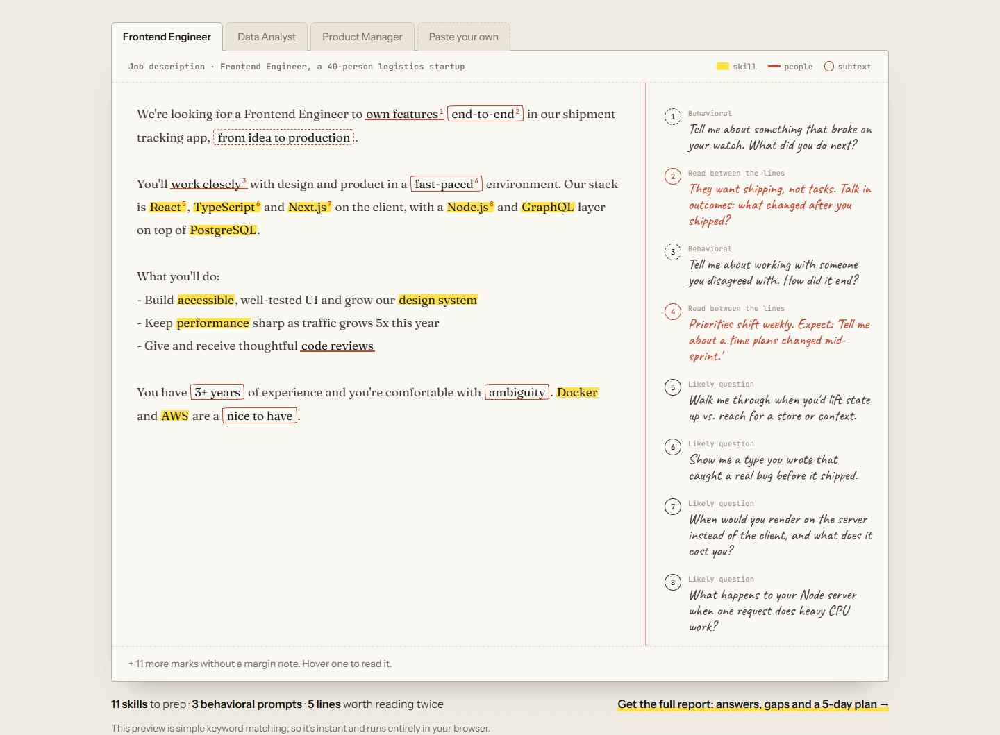

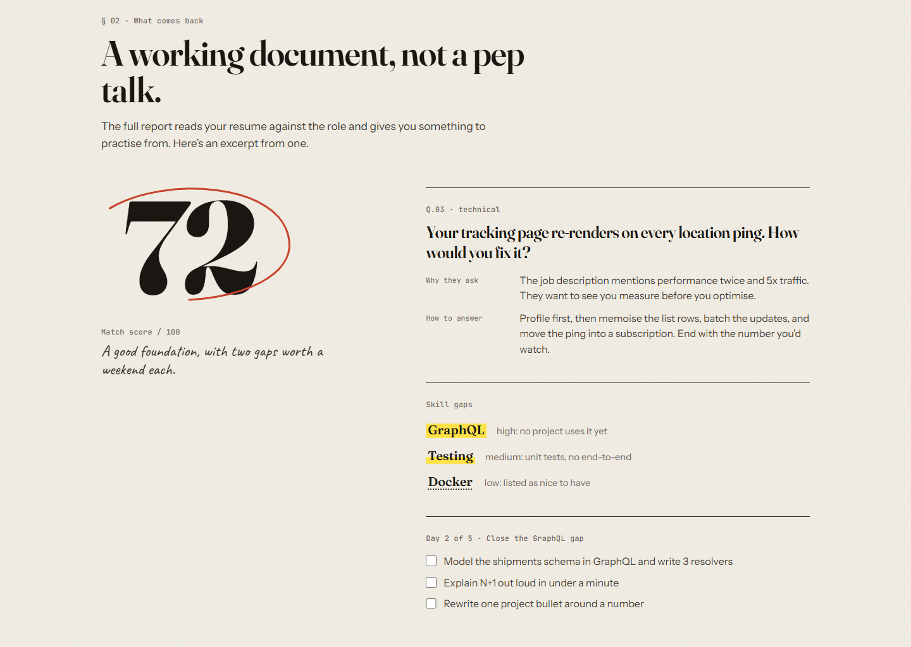

### Sign in and your desk

| Sign in | Dashboard |
|---|---|
| 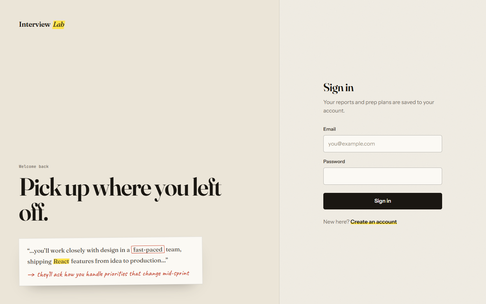 | 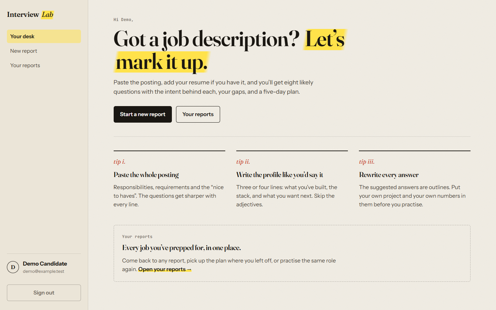 |

### New report and history

| New report (with today's allowance) | Report history (search, sort, filter, plan progress) |
|---|---|
| 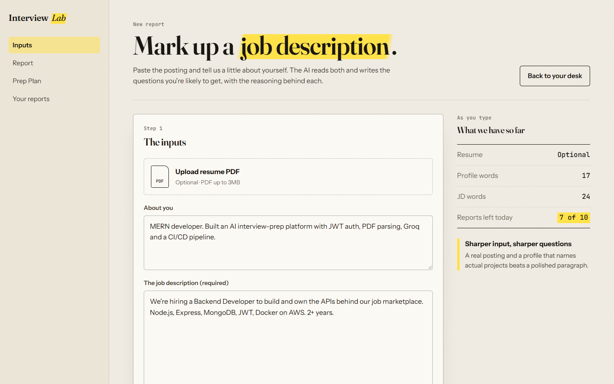 | 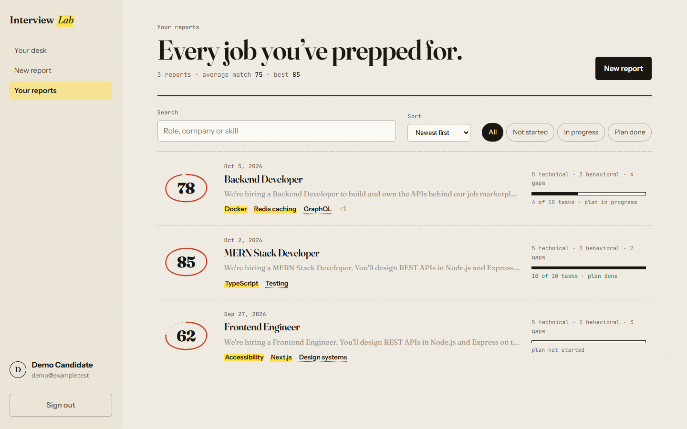 |

### The report

Match score, then your skill gaps marked on the posting itself, each linked to the plan day that covers it.

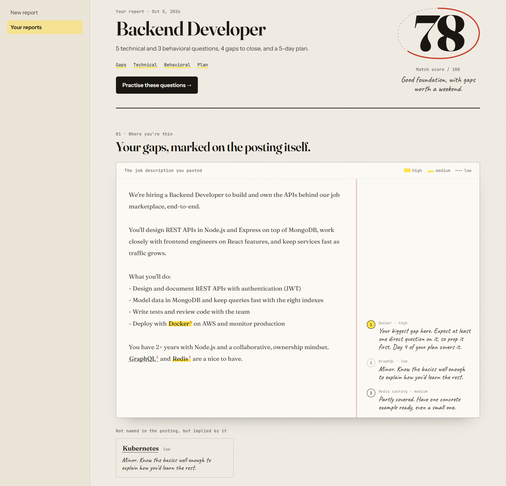

| Questions fold until you open them | Five-day plan, saved to your account |
|---|---|
| 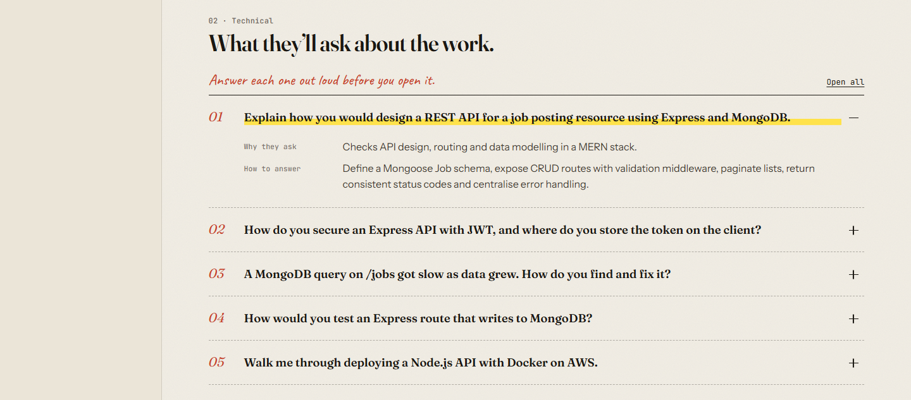 | 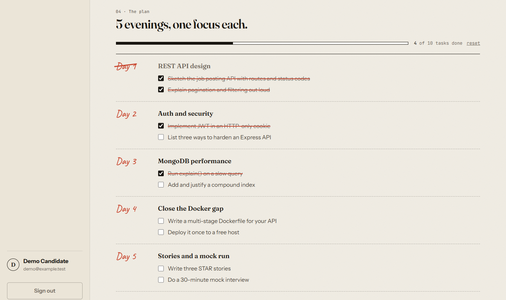 |

### Practice mode

Answer each question by typing or speaking, then get AI feedback: a score, four criteria, what worked, what to fix, and a stronger version of your answer. Chips show your best score per question; re-drill brings back the weak ones.

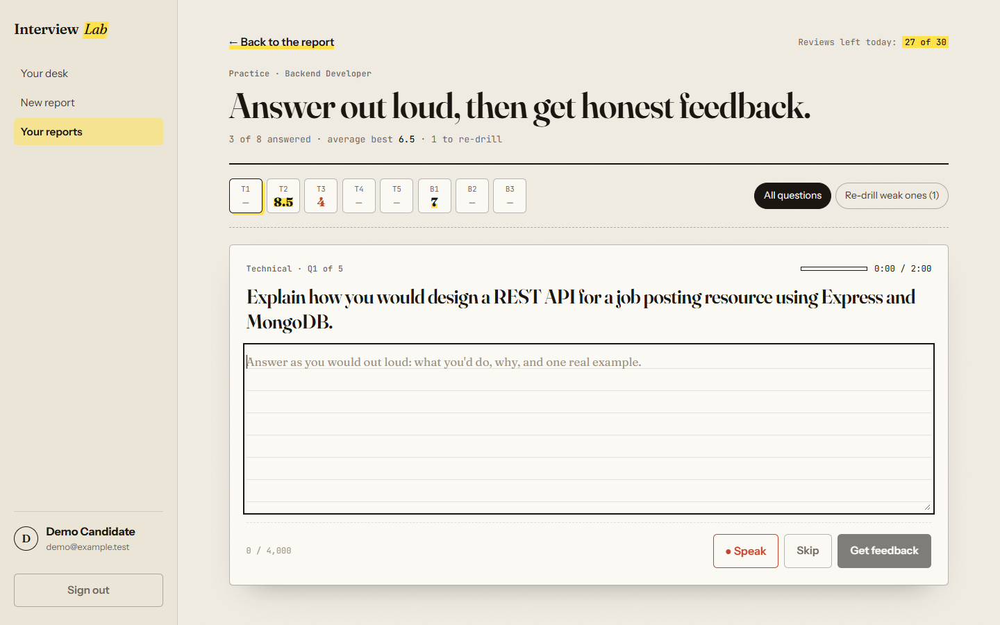

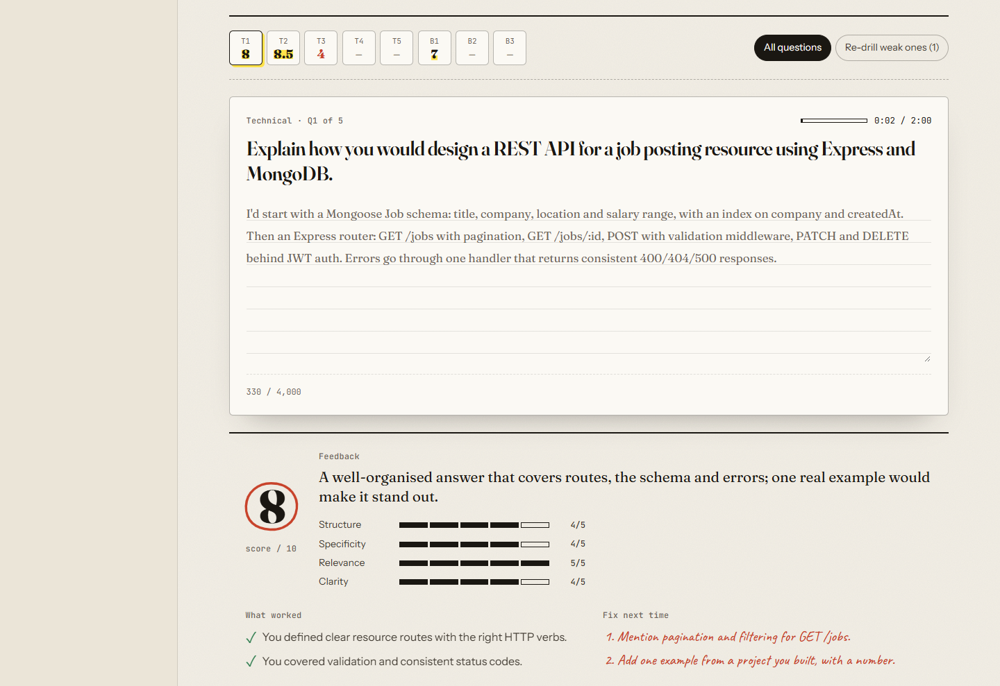

### On a phone

| Landing | Practice |
|---|---|
| 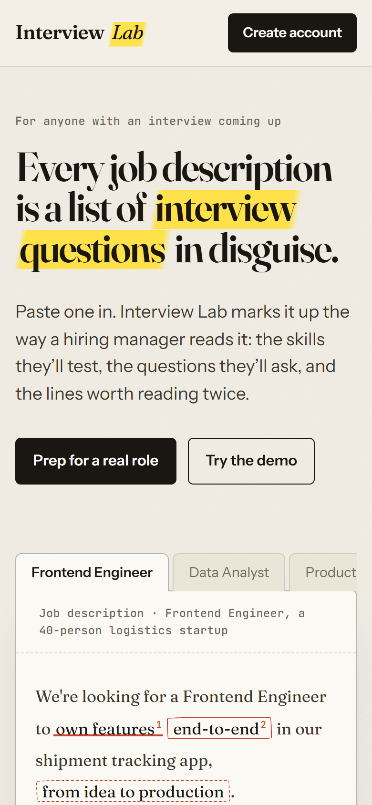 | 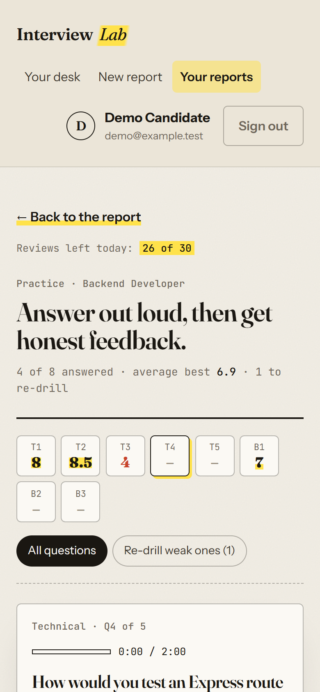 |

## How It Works

1. User registers or logs in.
2. User opens the new report page.
3. User uploads a resume PDF, optionally enters a self description, and pastes the job description.
4. Frontend sends multipart form data to the backend.
5. Backend authenticates the user through the JWT cookie.
6. Backend extracts resume text from the PDF.
7. Backend asks Groq for a JSON report that follows the report schema.
8. Backend validates the response with Zod, retrying up to 3 times if it doesn't match.
9. Backend saves the report in MongoDB with a readable title.
10. Frontend displays the generated report.

## Project Structure

```text
AI_POWERED_INTERVIEW_PLATFORM/
├── Backend/
│   ├── src/
│   │   ├── config/          # MongoDB connection
│   │   ├── controllers/     # auth and interview handlers
│   │   ├── middlewares/     # auth check, file upload
│   │   ├── models/          # user, report, token blacklist
│   │   ├── routes/
│   │   ├── services/        # AI report generation (Groq / Gemini)
│   │   └── app.js           # Express app, CORS, health check
│   ├── .env.example
│   ├── package.json
│   └── server.js
├── Frontend/
│   ├── src/
│   │   ├── components/      # shared UI (marked-up job description sheet, wordmark)
│   │   ├── features/
│   │   │   ├── ai/          # new report page and report components
│   │   │   ├── auth/        # login, register, auth state
│   │   │   └── landing/     # landing page demo
│   │   ├── lib/             # shared API client
│   │   ├── pages/           # landing page, dashboard
│   │   ├── app.router.jsx
│   │   └── main.jsx
│   ├── .env.example
│   ├── package.json
│   ├── vercel.json          # /api proxy to the backend + client-side routing
│   └── vite.config.js       # /api proxy in development
├── .gitignore
└── README.md
```

## Tech Stack

### Frontend

- React
- Vite
- React Router
- Axios
- Sass

### Backend

- Node.js
- Express.js
- MongoDB
- Mongoose
- JWT
- Multer
- pdf-parse
- Zod

### AI Integration

- Groq through `groq-sdk` (default model `openai/gpt-oss-120b`), used when `GROQ_API_KEY` is set
- Gemini through `@google/genai` (default model `gemini-2.5-flash`), used only when `GROQ_API_KEY` is not set
- Responses are validated against a Zod schema and retried up to 3 times

### Hosting

- Frontend: Vercel
- Backend: Render
- Database: MongoDB Atlas

## Installation & Setup

### 1. Clone Repository

```bash
git clone https://github.com/Piro-Programmer/AI_POWERED_INTERVIEW_PLATFORM.git
cd AI_POWERED_INTERVIEW_PLATFORM
```

### 2. Setup Backend

```bash
cd Backend
npm install
```

Create a `.env` file inside `Backend` (see `Backend/.env.example` for every option):

```env
PORT=3000
MONGO_URI=your_mongodb_connection_string
JWT_SECRET=your_jwt_secret
GROQ_API_KEY=your_groq_api_key
```

Get a Groq API key at https://console.groq.com/keys. To use a different Groq model, set `GROQ_MODEL`.

To use Gemini instead, leave `GROQ_API_KEY` out and set `GOOGLE_GENAI_API_KEY` (optionally `GEMINI_MODEL`).

Run backend:

```bash
npm start
```

For development with automatic restart:

```bash
npm run dev
```

Backend runs on:

```text
http://localhost:3000
```

### 3. Setup Frontend

```bash
cd ../Frontend
npm install
npm run dev
```

Frontend runs on:

```text
http://localhost:5173
```

In development, Vite proxies `/api` requests to `http://localhost:3000` (see `Frontend/vite.config.js`), so the frontend and backend share one origin and the auth cookie just works.

## CI/CD pipeline

Every change goes through [GitHub Actions](.github/workflows/ci-cd.yml) before it can reach production:

```text
pull request ─► detect changes ─► backend tests ┐
                                 frontend lint, │
                                 tests, build   │─► required checks ─► merge to main
                                 end-to-end     ┘
                                 (Playwright)

push to main ─► detect changes ─► tests (as above) ─► deploy backend (Render) ─► deploy frontend (Vercel)
                                                      exact tested commit,       after the API is live,
                                                      waits for /api/health      waits for the new build,
                                                      to report that commit      smoke-tests the live site
```

- **Only what changed runs:** backend changes test and deploy the backend; frontend changes the frontend; README-only changes skip both.
- **Nothing deploys untested:** Render and Vercel auto-deploys are off; the pipeline triggers them through deploy hooks only after every test job passes.
- **Exact commit, verified:** Render deploys the tested commit (`?ref=<sha>`). The pipeline then waits until `/api/health` reports it and the page's `app-version` meta tag shows it on Vercel.
- **Safe ordering:** the API deploys first, so a new UI never talks to an old API.
- **Smoke tests after deploy:** the live page loads, `/api/health` works through the Vercel proxy, and deep links like `/reports` load.
- **Fast:** jobs run in parallel with npm and MongoDB-binary caches. Newer PR pushes cancel older runs; runs on `main` never cancel mid-deploy.
- **Manual redeploy:** Actions → CI/CD → **Run workflow** re-tests and redeploys everything.

### Tests

**Backend** (Vitest + Supertest + an in-memory MongoDB via `mongodb-memory-server`). The AI is mocked, so tests never call Groq:

- auth: register/login validation, NoSQL-injection inputs rejected, per-account lockout after 10 failed sign-ins, logout blacklisting
- reports: generation, input caps, PDF type/size, summaries without resume text, one generation at a time, **another user's report is always a 404**
- quota: **20 parallel reservations against real MongoDB never exceed a limit of 10**, refunds, separate report/review allowances, burst limit
- practice: answer review, validation, ownership, refunds, daily limit, best/last score summaries
- app-wide: JSON 404/400/413 errors, security headers, CORS

**Frontend** (Vitest + Testing Library + jsdom): the job-description markup engines, gap matching, practice ordering, plan-progress saving (batched, retried, old browser ticks uploaded), login errors, history search/sort/filter, and the practice answer and feedback components.

```bash
cd Backend && npm test
```

```bash
cd Frontend && npm test
```

**End-to-end** (Playwright, Chromium): a real browser against the production frontend build, which proxies `/api` to the real backend running on an in-memory MongoDB. Only the AI is replaced, by a fixed fake loaded through a Node module hook ([e2e/server](e2e/server)), so the backend code itself is unchanged and no Groq quota is used.

- sign-up refuses a weak password, then signs in; signed-out users are sent to sign in; sign out, wrong password, sign back in
- generate a report → practise a question and get feedback → find it in your reports → delete it
- a report link opened from another account shows "not found"

```bash
cd e2e && npm ci && npx playwright install chromium
```

```bash
npm test
```

It needs `npm ci` in Backend and Frontend first. On failure, `npm run report` opens the HTML report with traces and screenshots; in CI it's uploaded as the `playwright-report` artifact.

The first backend run downloads a MongoDB binary (about 100 MB) once; it's cached after that.

## Deployment

The project runs with the **backend on Render** (a normal long-running Node server, so AI calls aren't cut off by serverless time limits) and the **frontend on Vercel**. Vercel forwards `/api/*` to Render, so the browser only ever talks to the Vercel domain and the login cookie stays first-party.

### 1. Backend on Render

1. In MongoDB Atlas, open **Network Access** and allow `0.0.0.0/0` (Render has no fixed IP).
2. On Render, create a **Web Service** from this repository:
   - Root Directory: `Backend`
   - Build Command: `npm install`
   - Start Command: `npm start`
   - Health Check Path: `/api/health`
3. Add environment variables:

   ```env
   MONGO_URI=your_mongodb_connection_string
   JWT_SECRET=a_long_random_string
   GROQ_API_KEY=your_groq_api_key
   NODE_ENV=production
   ```

4. Deploy, then open `https://<your-service>.onrender.com/api/health`. It should return `{"status":"ok", ...}`.
5. In **Settings → Build & Deploy**, set **Auto-Deploy** to **Off** (the CI/CD pipeline deploys instead), and copy the **Deploy Hook** URL.

On Render's free plan the service sleeps when idle, so the first request after a quiet period can take up to a minute.

### 2. Point the frontend at the backend

`Frontend/vercel.json` forwards `/api/(.*)` to this project's Render service. If you deploy your own copy, replace the Render URL there with yours, then commit and push.

### 3. Frontend on Vercel

1. Import the repository on Vercel.
2. Set **Root Directory** to `Frontend`. Do not use the "Services" preset.
3. The **Application Preset** should become **Vite** (build `npm run build`, output `dist`).
4. Deploy. No environment variables are needed for this setup.
5. In **Settings → Git → Deploy Hooks**, create a hook for the `main` branch and copy its URL. `vercel.json` already turns off Vercel's own automatic deploys of `main` (PR preview deployments still work).

### 4. Connect the pipeline

In the GitHub repo, open **Settings → Secrets and variables → Actions** and add two repository secrets:

| Secret | Value |
|---|---|
| `RENDER_DEPLOY_HOOK_URL` | the Render deploy hook URL |
| `VERCEL_DEPLOY_HOOK_URL` | the Vercel deploy hook URL |

Deploy hooks are secret URLs: anyone holding one can trigger a deploy, so keep them only in GitHub secrets. From then on, every merge to `main` is tested and deployed by the pipeline.

`vercel.json` also sends every non-API route to `index.html`, so refreshing `/dashboard` or `/interview` works.

### Calling the backend directly instead (optional)

If you'd rather not proxy through Vercel, set `VITE_API_URL=https://<your-service>.onrender.com` on Vercel, and on Render set `CLIENT_URL=https://<your-app>.vercel.app` and `COOKIE_SAMESITE=none`. Some browsers block cross-site cookies, which is why the proxy setup is recommended.

## API Flow

| Step | Action |
| ---- | ------ |
| 1 | User logs in or registers |
| 2 | User submits resume, self description, and job description |
| 3 | Frontend sends multipart form data |
| 4 | Backend authenticates user and parses resume |
| 5 | Groq generates the structured report |
| 6 | Backend validates it and saves it in MongoDB |
| 7 | Data is returned to the UI |

## Main API Routes

### Auth

```text
POST /api/auth/register
POST /api/auth/login
GET  /api/auth/logout
GET  /api/auth/get-me
```

### Interview Reports

```text
POST /api/interview        # generate a report
GET  /api/interview        # list your reports (summaries)
GET  /api/interview/usage  # today's allowances: { usage, reviewUsage }, each { limit, used, remaining, resetsAt }
GET  /api/interview/:id    # one report in full
DELETE /api/interview/:id  # delete a report and its practice attempts
PATCH /api/interview/:id/progress   # save ticked plan tasks, body: { "completedTasks": ["0-1", "2-0"] }
POST /api/interview/:id/practice    # review one answer, body: { kind, index, answer, durationSeconds, inputMode }
GET  /api/interview/:id/practice    # per-question attempts, best/last score and latest feedback
```

### Health

```text
GET  /api/health
```

## Future Improvements

- Performance scoring dashboard
- Difficulty levels: easy, medium, hard

## Interview Explanation

I built Interview Lab, an AI-powered interview preparation platform using the MERN stack and the Groq API. Users paste a job description, optionally upload a resume, and get a structured report: match score, likely technical and behavioral questions with the intent behind each, skill gaps highlighted inside the job description, and a five-day plan they can tick off. The AI output is validated against a Zod schema before it's saved, and the app is deployed with the frontend on Vercel proxying to an Express backend on Render.

## What This Project Shows

- Full-stack development with MERN
- Authentication with HTTP-only JWT cookies
- File upload and PDF parsing
- LLM integration with schema-validated, retried structured output
- REST API design
- MongoDB data persistence, including an atomic per-user daily quota
- Production hardening: rate limiting, input limits, security headers
- Automated tests against a real in-memory database, and a CI/CD pipeline that deploys only tested, verified commits
- Production deployment across Vercel and Render with a same-origin API proxy
- A distinctive, interactive UI built without a component library
